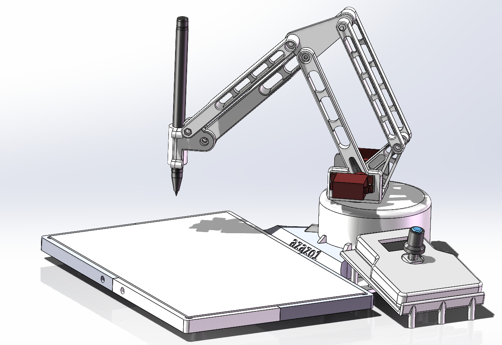
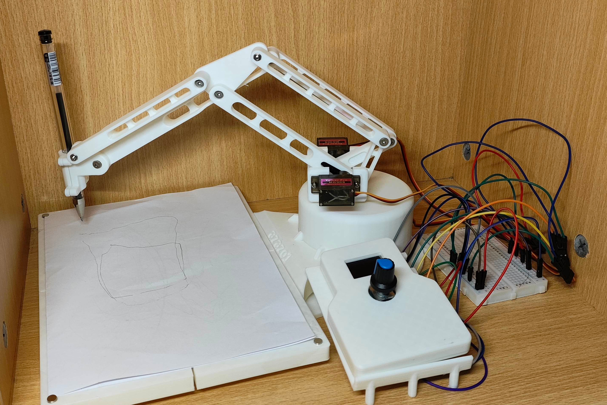

# 写字机械臂

项目地址: https://github.com/azazo1/WritingArm.

此项目为我个人在暑假期间独自开发, 仍有许多疏漏之处, 成品仅为玩具级别,
供感兴趣者参考和学习, 欢迎大家提出建议或进行修改, 希望通过这个项目能够与更多志同道合的朋友共同进步.

# 展示图

## 建模图

## 实物图

# 介绍

## 机械臂本体

此写字机械臂本体分为 4 个部分: 托纸台, 底座, 动臂, 以及控制台.

### 托纸台

托纸台由四个小块及一个底座槽拼接而成.
对角的两个小块互相相同, 每个小块都有一个磁铁槽, 用来放置磁铁进行夹纸.

### 底座

底座可卡入底座槽, 内部含有一个舵机, 舵机通过齿轮传动控制 A 轴旋转.
A 轴旋转轴使用两个深沟球轴承进行固定和转动.

### 动臂

动臂部分包括两个舵机, 分别控制 B 轴与 C 轴的旋转, 除了 B 轴杆和 C 轴杆外还有几根定角杆,
通过平行四边形的对边平行关系来使圆珠笔始终保持垂直底面的方向.

### 控制台

控制台可以放置在控制台架上, 控制台除了外壳外, 内部含有 OLED 显示屏, EC11 旋转编码器以及 ESP32 单片机.
控制台用户交互界面通过 [OLED_UI](https://github.com/azazo1/OLED_UI) 库进行编写,
可以用直观的方式创建 UI, 并且实现复杂任务的异步调度, 还能实现类似协程的功能.

EC11可以按下和旋转, 故交互逻辑是旋转进行选项的控制, 短按确认操作, 长按取消操作.
在控制台的交互界面中, 可以使用仅机械臂本体就能实现的功能:

- 控制机械臂的三个舵机角度.
- 控制笔尖的 xyz 位置.
- 控制笔尖的极坐标位置.
- 进行网络设置:
    - 随时都可以切换 AP 和 STA 模式, 还提供了一个简单的软键盘来进行 ssid 和密码的输入.
    - 查看当前 IP 地址.
    - 清除当前的网络配置并重启单片机.

网络配置成功后, 查看 IP 将会读取到有效 IP 地址, 连接此 IP 地址, 可以对机械臂进行无线控制.

### 其余说明

由于使用的是 3D 打印件, 精度有限, 故使用购买舵机时自带的舵机臂, 通过在 3D 打印件上挖出舵机臂的槽口来进行传动.

## 安卓客户端(平板+笔)

安卓客户端简单地实现了和机械臂的连接, 操作与配置.
在安卓客户端中, 可以手动输入 IP 地址连接单片机(即控制台),
也可以通过 UDP 广播发现的按钮快速获取控制台 IP.

和单片机连接成功后可以使用笔绘和网络配置两个功能.

### 笔绘

进入笔绘功能后, 拿出平板的手写笔, 将手写笔悬空在屏幕上方或者按压屏幕, 可以看到机械臂圆珠笔动作和平板手写笔同步,
机械臂圆珠笔按压纸面的力度也会和平板手写笔同步.

但由于数据是实时传输的, 单片机同时处理网络传输和舵机控制, 会稍显卡顿, 故可以在笔绘功能下方的录制按钮提前录制好动作序列,
停止录制后发送动作序列即可让机械臂重复录制好的动作, 机械臂执行动作期间不需要网络传输,
在执行动作期间发送新的动作序列会中止原来的动作序列, 并开始执行新的动作序列.

### 网络配置

如果觉得机械臂本体控制台进行网络配置时使用软键盘输入 WiFi 的 ssid 和密码过于麻烦,
可以与机械臂建立连接(使用控制台默认的AP模式可快速启动网络)后, 在安卓客户端输入 ssid 和密码并选择目标网络模式,
即可进行配置, 配置生效后, 需要重新连接机械臂.

# 文件下载

3D模型使用 Solidworks 建模, 在 releases 中可以下载.

安卓客户端源代码在 [WritingArmClient-android](WritingArmClient-android) 目录下,
建议通过平板以及手写笔来使用此应用.

# 开发环境及使用的器件

- ESP32-WROOM-32 开发板.
- SSD1306 OLED 显示屏.
- EC11 旋钮.
- MG90S 模拟舵机 3 个.
- 3D 打印零件.
- 使用 PlatformIO, Clion, Android Studio(Kotlin + Jetpack Compose 框架) 及 Solidworks 进行开发.

# 使用到的库

- [ArduinoWebSockets](https://github.com/gilmaimon/ArduinoWebsockets)
- [ArduinoJson](https://github.com/bblanchon/ArduinoJson)
- [OLED_UI](https://github.com/azazo1/OLED_UI) ( 本人拙作.)
  → [esp8266-oled-ssd1306](https://github.com/ThingPulse/esp8266-oled-ssd1306)